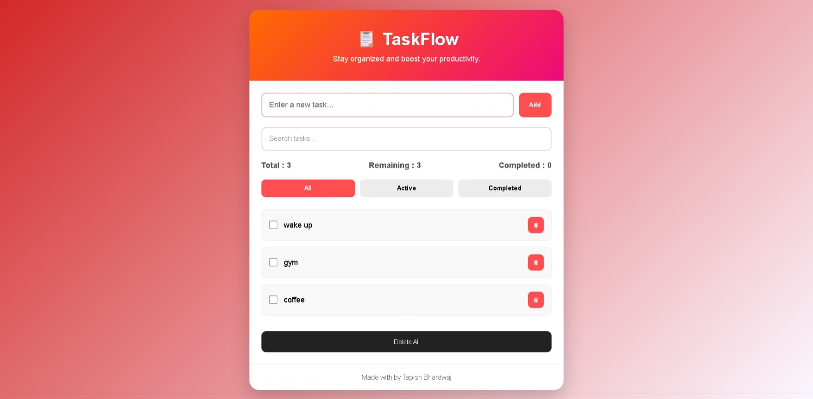

# 📋 TaskFlow - Todo App

A modern and responsive Todo App built using **HTML**, **CSS**, and **Vanilla JavaScript**. It helps users organize daily tasks with a clean interface and stores data using Local Storage, so tasks remain available even after refreshing the page.

---

## 🚀 Live Demo

https://tapishbhardwaj.github.io/taskflow-todo-app/

---

## 📸 Screenshot



---

## ✨ Features

- ➕ Add new tasks
- ✅ Mark tasks as completed
- ✏️ Edit tasks by double-clicking
- 🗑 Delete individual tasks
- 🧹 Delete all tasks
- 🔍 Search tasks instantly
- 📂 Filter tasks (All / Active / Completed)
- 📊 Task counters (Total & Remaining)
- 💾 Local Storage support
- 📱 Responsive Design

---

## 🛠 Tech Stack

- HTML5
- CSS3
- JavaScript (ES6)
- Local Storage API

---

## 📂 Folder Structure

TaskFlow/
│── index.html
│── style.css
│── script.js
│── README.md
│
└── images/
    └── Screenshot.jpeg

---

## 💻 How to Run

1. Clone this repository

```bash
git clone https://github.com/tapishbhardwaj/taskflow-todo-app.git
```

2. Open the project folder.

3. Run `index.html` in your browser.

---

## 🎯 Future Improvements

- 🌙 Dark Mode
- ⭐ Task Priority
- 📅 Due Date
- 🔔 Notifications
- ☁ Cloud Sync

---

## 👨‍💻 Author

**Tapish Bhardwaj**

GitHub:
https://github.com/tapishbhardwaj

---

⭐ If you found this project helpful, consider giving it a star on GitHub.